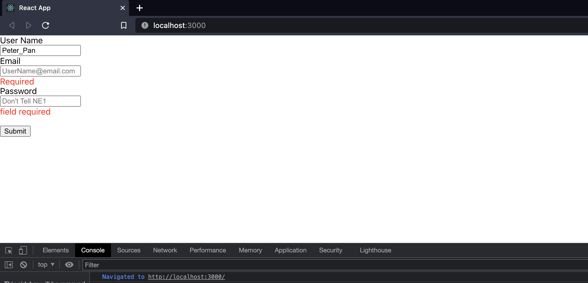

# PacMen-Exercise
The React-and-Formik-Example was created for MITxPro full stack web development program.  

## Description:

 The React-and-Formik-Example is an imput form using email and password fields. Using Formik, the form should implement the following input validation rules  
  
- If the username or password inputs are empty, display the message "Field required" under the text input.
  
- If the username is not in an email format, display the message "Username should be an email" under the text input.
  
- If the username and password pass the above validations, then display the message "Login Successful" in an alert box.  

## Installation:

 You can replicate this project in your favorite code editor using Formik. Create a new folder on your desktop and open the folder in your code editor. In the code editor terminal, run 'npm install formik --save'. 
  
- You can now run the program in development mode by running 'npm start' in the terminal.

## Usage:

  
This form exercise is an example of how to create a login form with validation using Formik and React.

## Roadmap:

*
 This exercise will continually be built and improved on as I learn additional skills in Javascript and React. 
*

***

**
 Future updates: 
**
- Create custom fields for a email subscriber form
- Add style
- make form deployable  

## Support:

 Want to share feedback or comments?

 
  
  Reach me on *[Linkedin](https://www.linkedin.com/in/derek-diaz/)* or *[Twitter](https://twitter.com/home).*
  

