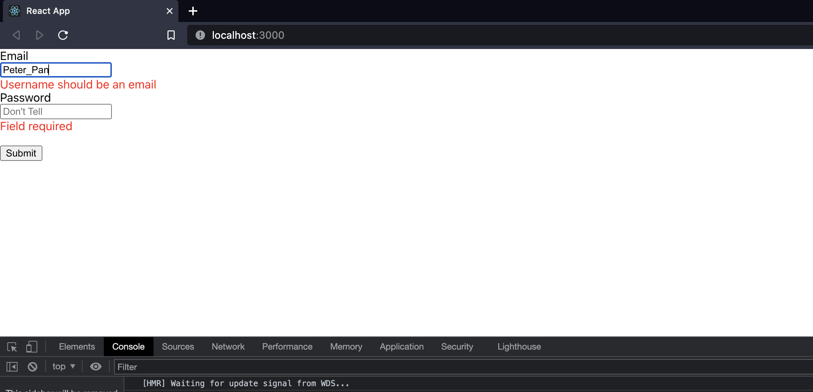

# PacMen-Exercise
The PacMen exercise was created for MITxPro full stack web development program.  

## Description:

 The PacMen-Exercise creates Pacmen through a function coded in the Pacemen.JS file. The Pacmen can be set in motion by clicking the start button. The velocities of the Pacmen is set by Math.Random().

 This exercise was built to demonstrate how pulled objects from arrays can be manipulated in the DOM. Coded in JavaScript, check out the pacmen.js for additional details.
 

## Installation:

 Upload the HTML file to your browser or fork and clone the project saving the files to your local hard drive.

    
 You can also run the program by clicking on the Pacman picture in this readme file. 

## Usage:

  
You can add the Pacmen to the screen by clicking the "Add Pacman" button. You can set the Pacmen in motion by clicking the "Start Pacmen" button. Have fun watching the Pacmen animate the screen. 

## Roadmap:

*
 This exercise will continually be built and improved on as I learn additional skills in Javascript. 
*

***

**
 Future updates: 
**
- Create collison barriers for pacmen to collide with. 
- Make the packmen change colors/size when colliding against a wall.
- Add functinal buttons that can manipulate the pacmen on the screen. 

## Support:

 Want to share feedback or comments?

 
  
  Reach me on *[Linkedin](https://www.linkedin.com/in/derek-diaz/)* or *[Twitter](https://twitter.com/home).*
  

